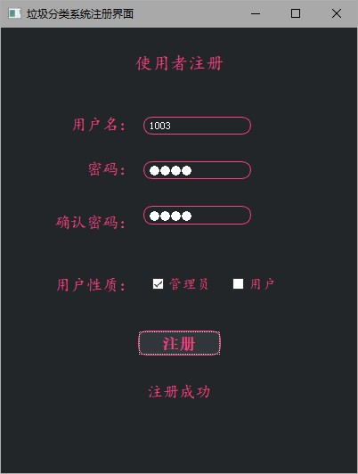
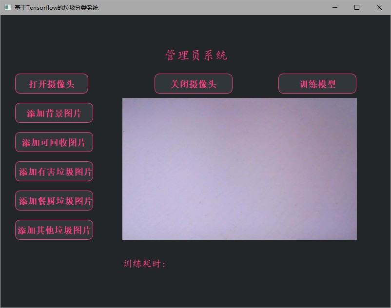
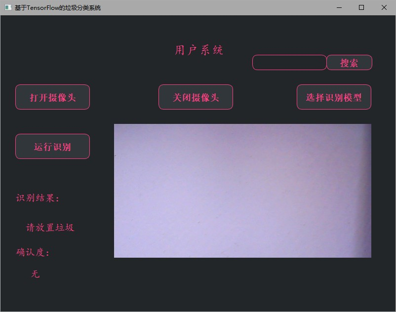

# 项目描述
该项目基于PySide2和PyQt5设计界面UI，搭配QT Designer进行界面设计。
基于TensorFlow中的Keras模型，进行垃圾分类模型的训练。
项目包含功能有：使用者注册登录功能、管理员训练模型、用户使用模型进行分类。

# 功能介绍

## 一、注册登录
1、注册登录使用SQLite数据库进行账号数据的存储，注册过程中选择使用者性质（管理员 or 用户）作为后续系统登录的区分。主要存储的数据有用户名、密码以及用户性质，其中用户名作为主键，唯一标识。
2、注册过程填写用户名、密码、确认密码、选择用户性质后点击注册按钮，若注册成功则注册按钮下方出现“注册成功”的提示字样。

## 二、登录功能
在登录界面输入用户名与密码，系统搜索数据库中账号信息，根据用户标识选择进入相应的使用系统界面（管理员系统 or 用户系统）。

## 三、管理员系统功能
1、管理员的功能主要有打开摄像头，添加训练集（背景图片和要训练的垃圾图片），关闭摄像头，进行模型训练，模型训练结果呈现。
2、摄像头的打开与关闭主要通过注册一个定时器来进行控制，采集图像的原则一般是每个垃圾采集不同角度的15~30张图片。
3、模型训练过程采用监督学习方式，即将采集到的训练集打上标签，在进行训练，得到的训练模型保存在tmp本地文件夹下，以当前训练时间命名。
4、训练模型时的每一轮结果在控制台打印，而在UI界面呈现最终的训练时间。

## 四、用户系统功能
1、文字搜索：用户使用输入框输入需要确认的垃圾分类情况，点击搜索按钮，结果显示区域将会呈现搜索结果，如无搜索结果，则提示使用图像识别垃圾分类。
2、图像搜索：首先打开摄像头，点击选择模型按钮，将训练好的模型上传，点击运行检测按钮，进行垃圾分类的图像识别。图像识别的结果在左侧检测结果区域呈现（包括检测结果和确认度）。
3、语音播报：在文字搜索呈现搜索结果时，具有语音播报，将搜索结果以声音的方式呈现出来。

# 项目搭建

系统：windows10 
编译器：VsCode
硬件：免驱USB摄像头
环境：python 3.7.0

## 一、项目使用到的库

| 库文件             | Version  |
| ------------------ | -------- |
| PyQt5              | 5.15.4   |
| PySide2            | 5.15.2   |
| opencv-python(cv2) | 4.5.2.52 |
| numpy              | 1.18.5   |
| tensorflow         | 2.3.0    |
| tensorflow_hub     | 0.12.0   |
| keras              | 2.4.3    |
| requests           | 2.25.1   |
| urllib3            | 1.26.4   |

## 二、项目目录结构
| 文件名           | 作用或功能                           |
| ---------------- | ------------------------------------ |
| dataset          | 数据集（包含训练集和测试集）         |
| img              | 用于存放项目效果图                   |
| model            | 训练依据模型                         |
| style            | 存放QSS文件，几个UI界面的样式文件    |
| tmp              | 存储训练完成得到的模型               |
| administrator.py | 实现管理员界面                       |
| administrator.ui | 利用QT设计师得到的管理员界面设计文件 |
| projectMain.py   | 项目程序的主入口                     |
| register.py      | 实现注册界面                         |
| register.ui      | 利用QT设计师得到的注册界面设计文件   |
| resident.db      | 使用者账户数据库                     |
| user.py          | 实现用户界面                         |
| user.ui          | 利用QT设计师得到的用户界面设计文件   |

## 三、项目搭建
1、建议使用vscode编辑器，配置插件有：Qt for Python 、SQLite。
如果电脑中无python环境，可参考该安装步骤[Anaconda的下载与安装——Python环境搭建](https://blog.csdn.net/gets_s/article/details/112105030)。
2、对于vscode配置python环境：ctrl + shift + P, 点击Python选择器,选择适用的python环境，这里建议使用conda搭建一个新的python环境，具体搭建过程可参考：[创建conda虚拟环境，优雅地管理python环境](https://blog.csdn.net/gets_s/article/details/116464157)。
3、当环境配置完成后，下面是运行项目阶段，运行项目入口文件projectMain.py即可。以下是项目最终的效果图：
【登录界面】

【注册界面】

【管理员界面】

【用户界面】

## 四、注意事项
1、注意运行项目时需要连接外接USB摄像头。
2、同时项目中不含有训练集（需自己根据需要进行采集背景图片和垃圾图片）。
3、项目中更没有训练好的模型，故使用者需要自己训练模型（注册管理员账号，在管理员系统界面进行训练模型）。

